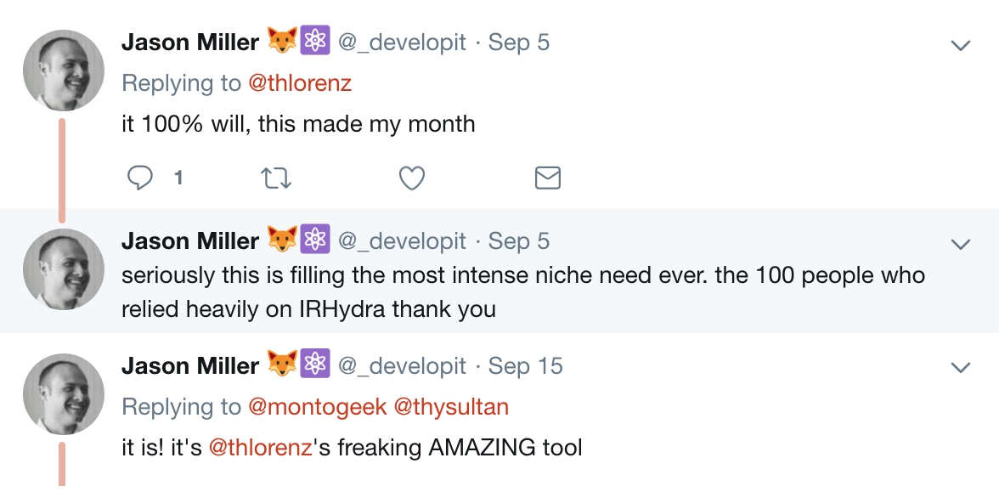
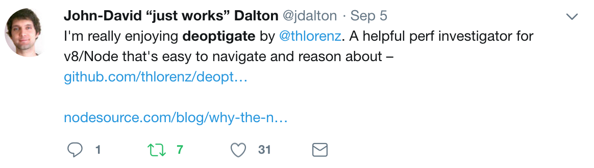

# deoptigate

<a href="https://www.patreon.com/bePatron?u=8663953"></a>

```js
deoptigate app.js
```

[](https://thlorenz.com/deoptigate-examples/xml2js/01_start/?selectedFileIdx=31&selectedLocation=157&includeAllSeverities=false&highlightCode=true&selectedTabIdx=1&selectedSummaryTabIdx=1)

## What Performance Experts Say About Deoptigate

<table>
  <thead>
  <tr>
    <td>
      Jason Miller aka
      <a href="https://twitter.com/_developit">@_developit</a>, creator of
      <a href="https://preactjs.com/">preact</a>.
    </td>
    <td>
    John-David Dalton aka
      <a href="https://twitter.com/jdalton">@jdalton</a>, creator of
      <a href="https://lodash.com/">lodash</a>.
    </td>
  </tr>
  </thead>
  <tbody>
  <tr>
    <td>
      
    </td>
    <td>
      
    </td>
  </tr>
  </tbody>
</table>

## Blogposts about Deoptigate

<table>
  <body>
  <tr>
    <td>
      <a href="https://nodesource.com/blog/why-the-new-v8-is-so-damn-fast">
        <span>Why the New V8 is so Damn Fast</span>
        
      </a>
    </td>
    <td>
      <a href="https://nodesource.com/blog/tracking-down-performance-bottlenecks-nsolid-deoptigate">
        <span>Tracking Down and Fixing Performance Bottlenecks with N|Solid and Deoptigate</span>
        
      </a>
    </td>
  </tr>
  </tbody>
</table>

## Installation

    npm install -g deoptigate

## Usage

### Deoptigate your App in one Step

```
deoptigate app.js
```

Override Node.js executable and/or pass it custom arguments

```
deoptigate -- /bin/mynode app.js
```

```
deoptigate -- node --allow-natives-syntax app.js
```

### Deoptigate existing `*-v8.log`

Simply run `deoptigate` from the directory that contains the log file(s).

## License

MIT
