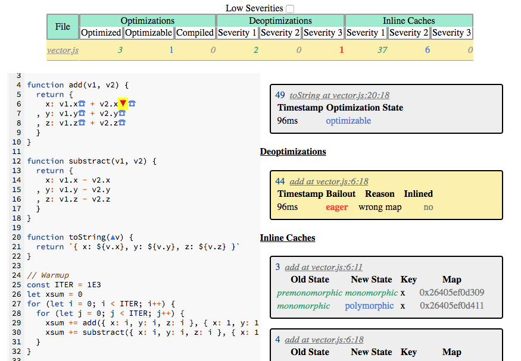

# deoptigate

Investigates v8/Node.js function deoptimizations.

```js
node --trace-ic app.js
deoptigate
```

[](https://thlorenz.com/deoptigate/vector/)

## Installation

    npm install -g deoptigate

## License

MIT
